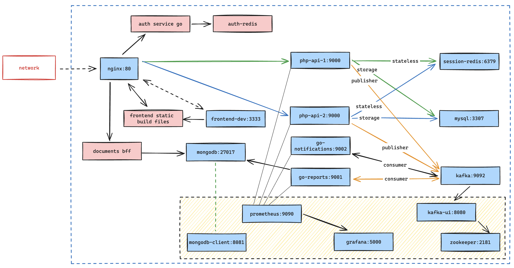

# php-api

Total elapsed time:

## Description

This project is a practical application of a managed containerized environment, leveraging design system solutions, DevOps principles and clean architecture. It serves as a boilerplate for building applications that prioritize maintainability, performance, and scalability, all while keeping costs to a minimum.

## Key Elements

- Development containerization with Docker Compose
- Scalable PHP 8.3 API, leveraging multiple instances
- Golang services for async processing
- MySQL 8.0 database for relational storage
- Redis for document/caching/session storage
- Clean architecture concepts applied globally
- Apache Kafka for message queuing
- MongoDB for document storage
- Grafana and Prometheus for monitoring
- Shared authentication service

Features which are present in docker compose and being developed are highlighted in blue.
Features which are still pending development are highlighted in red.

## Challenges and Solutions

- **How to manage multiple instances of the PHP API container?**
  - Use Docker Compose to manage the containers and their dependencies.
  - Use a reverse proxy to distribute traffic to the containers.
  - Stateless PHP containers leveraging sessions stored in Redis.
- **How to provide async processing for the API?**
  - Use Golang services to handle async processing.
  - Use Apache Kafka for message queuing.
  - PHP APIs are the producers and Golang services are the consumers.
- **How to provide data reports with high performance for the user?**
  - We can leverage the concept of BFF (Backend for Frontend) to provide efficient data aggregation.
  - Use MongoDB for document storage and Golang services for data aggregation.
  - When enough data is collected, the Golang service will generate reports and store them in MongoDB.
  - Later retrieval of reports will be fast and efficient.
- **How to provide visibility into the system?**
  - Use Grafana and Prometheus for monitoring.
- **How to provide notifications to the user?**
  - Use Apache Kafka for message queuing.
  - Use Golang services to consume messages and send notifications.
- **How to provide authentication and authorization?**
  - Use a shared authentication service for all components.
  - Use JWT tokens for authentication.

## Future Features

- BFF (Backend for Frontend) for data aggregation and efficient queries for specific use cases on the frontend
- React + TS frontend consuming BFF
- Reusable authentication service shared between components0  
- CI/CD pipelines, integration and unit tests for each service
- Leveraging Apache Kafka for async processing capabilities
- K8S configuration for scaling and managing the application in a production environment
- Notification service consuming from topic to provide status updates
- Use ELK stack for logging.
- Use Jaeger for tracing.
